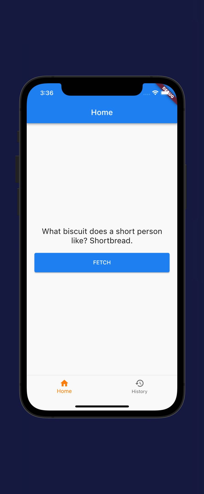

# Summary

- A simple mobile app created 3 different times with:
  - [Flutter](https://docs.flutter.dev/get-started/install/macos)
  - [React Native (Expo)](https://docs.expo.dev/get-started/installation/)
  - [Xamarin (Forms)](https://dotnet.microsoft.com/en-us/learn/xamarin/hello-world-tutorial/install)

## App Features

- Simple tab navigation

  - Home - Fetch dadJoke from [Dadjoke API](https://icanhazdadjoke.com/api)
  - History - shows a list of past dadJoke item(s)

- Material Icon for tab images
  

## Measurement

General categories of how I would score each framework based on my experience

- **Ease of getting started** (boilerplate code, documentation, technical requirements)
- **Developer support** (open source, community, documentation)
- **Developer experience** (native support, debugging, flexibility)

# Summary

## Flutter

- **Language**: Dart
- **Package manager**: https://pub.dev/
- **Common design pattern**: BLoC

### Personal Ratings

[See the README](./flutter/app/README.md) for more details

**Ease of getting started**:  

- For someone who's never touched Dart of Flutter, the onboarding experience was very smooth

**Developer Support**:  

- Flutter is the newer framework out of the three, so it's expected that there's a lot of activity in the community.
- Official documentations are very thorough.
- It's clear which plugins are most popular and active, everyone and their mom is endorsing it

**Developer Experience**:  

- Developer docs are very detailed and thorough.
- Pre-packaged debugging tool is very intuitive and easy to understand

## React Native (Expo)

- **Language**: Javascript/Typescript
- **Framework**: React
- **Package manager**: npm
- **Common design pattern**: Redux

## Xamarin Forms

- **Language**: C#/F#
- **Framework**: .NET
- **Package manager**: Nuget
- **Common design pattern**: MVVM

### Personal Ratings

[See the README](./xamarin/README.md) for more details

**Ease of getting started**:  

- Forced to use Visual Studio IDE. Auto imports felt a bit off at times.
- Boilerplate code wasn't able to be executed right away
  - Forced to have latest XCode version (not backwards compatible friendly)

**Developer Support**:  

- Official documentation was very basic
- A lot of the community posts and questions are outdated
- Limited amount of open source plugins
- Very dependent on Xamarin team to stay up to date with platform changes

**Developer Experience**:  

- Great MVVM support
- Very basic documentation and little to no code documentation.
- Hot reloading only works with XAML changes
