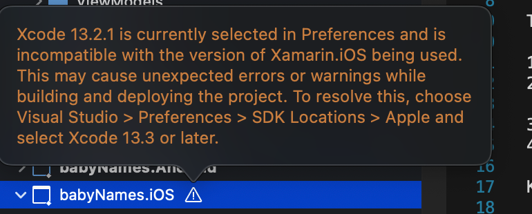

# Summary

- A simple mobile app created 3 times with 3 different frameworks
  - [Flutter](https://docs.flutter.dev/get-started/install/macos)
  - React Native
  - [Xamarin](https://dotnet.microsoft.com/en-us/learn/xamarin/hello-world-tutorial/install)

## Similarities

- All support hot reloading

## Flutter

- Language: Dart
- Great documentations & developer experience
- Compiles all the way down to native code
- Good boilerplate

### Run on iOS Simulator

- Run `cd flutter/app`
- Ensure a simulator is up and running. Run `flutter devices` to verify
- Run `flutter run`

## React Native (Expo)

- Language: Javascript/Typescript
- Framework: React
- Huge open source community
- Can write native code
- Bridge

## Xamarin Forms

- Language: C#/F#
- Framework: .NET
- Bad developer experience
  - instantly ran into an issue with local Xcode version mismatch, which prevented me from building and running the boilerplate code
  - Forces me to install latest xcode
  - 
- Requires IDE install & development (Visual Studio)
- Can't write native code
- Hot reloading
- Depends on Xamarin team to support latest platform updates
- Limited access to open source libs
- Wraps native code
- Will be replaced by MAOUI

### Run on iOS Simulator
