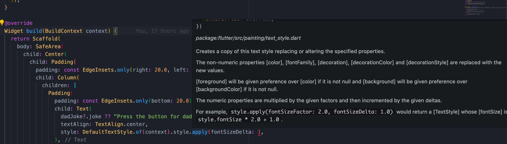
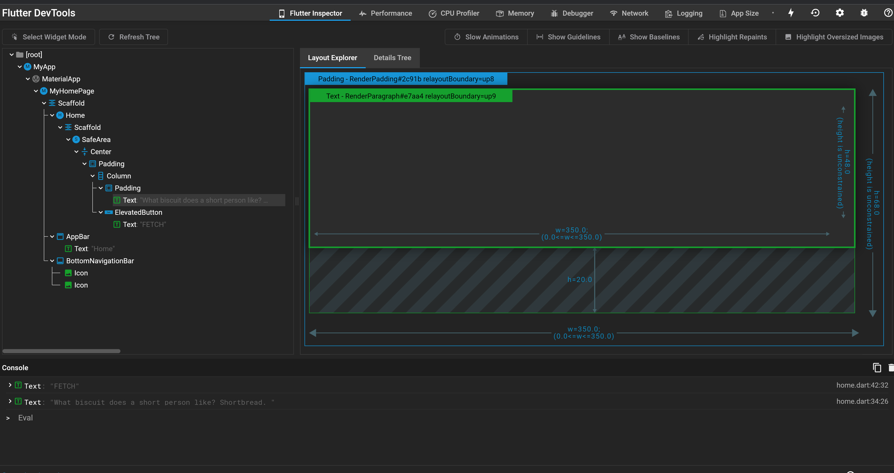

# app

- Compiles all the way down to native code
- Good boilerplate and developer docs

## Requirements

- [Installing Flutter](https://docs.flutter.dev/get-started/install/macos)
- XCode (for iOS build tool and simulator)

## Run on iOS Simulator

- Run `cd flutter/app`
- Ensure a simulator is up and running. Run `flutter devices` to verify
- Run `flutter run`

# Ease of getting started

- Very impressed with the boilerplate code
- Had built in support for Material Icons
- No issue setting up and running initial project

# Developer support (open source, community, documentation)

- Flutter documentation is very detailed and contains quick video guide on almost all the widgets I've looked at
- All the roadblocks I encountered were able to be resolved from their documentations
- [Package manager site](https://pub.dev/) was very easy to use and navigate
- Has plugin to help onboard new devs to the [BLoC design pattern](https://pub.dev/packages/flutter_bloc)

# Developer experience (native support, debugging, flexibility)

- Was able to develop in my editor of choice (VSCode)
- Really nice developer docs on methods and properties
  - 

## Hot Reloading

- Manual hot reloading (unless using the Dart extension). Had to press `r` or `R` in the terminal whenever I wanted to reload
- hot reloading feature needed configuration update when it came to resource/icons update
- Lacks developer doc on methods - 

## Debugging tool

- Pre-packaged debugging tool works great out of the box
  
