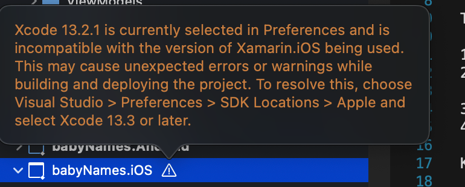
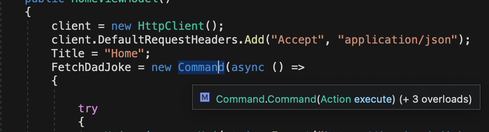

# Xamarin Forms

- Xamarin will be replaced by [MAUI](https://devblogs.microsoft.com/xamarin/the-new-net-multi-platform-app-ui-maui/) in the near future

## Run on iOS simulator

- Open the project in Visual Studio and hit the play button

# Ease of getting started

- Requires downloading IDE Visual Studio and pretty much forces you to work in that enviromnemt.
- instantly ran into an issue with local Xcode version mismatch, which prevented me from building and running the boilerplate code
  - Forces me to install latest xcode, not super friendly on the backwards compatibility.
  - 

# Developer support (open source, community, documentation)

- Many of the issues I Googled had outdated answers. Ended up referencing the MS Official documentations most of the time for general trial and error.
- Little to no documentations and examples on how to wrap your own native code for use
- Wraps native functionality in C# methods of the same name, which creates a strict dependency on the Xamarin team to support and update future platform updates

# Developer experience (native support, debugging, flexibility)

- Native code can technically be written, but with C#, which feels a bit weird.
- Xamarin has a fully flushed out support for MVVM Architecture. It makes it easier to keep codebase clean and organized.

## Hot Reloading

- hot reloading feature needed configuration update when it came to resource/icons update
- Lacks developer doc on methods - 
